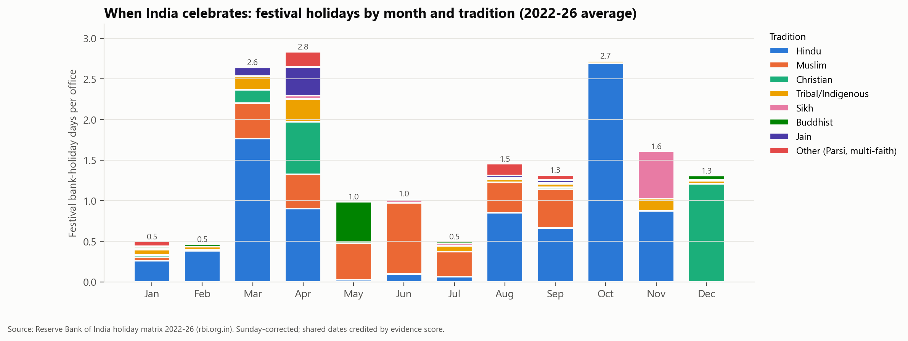
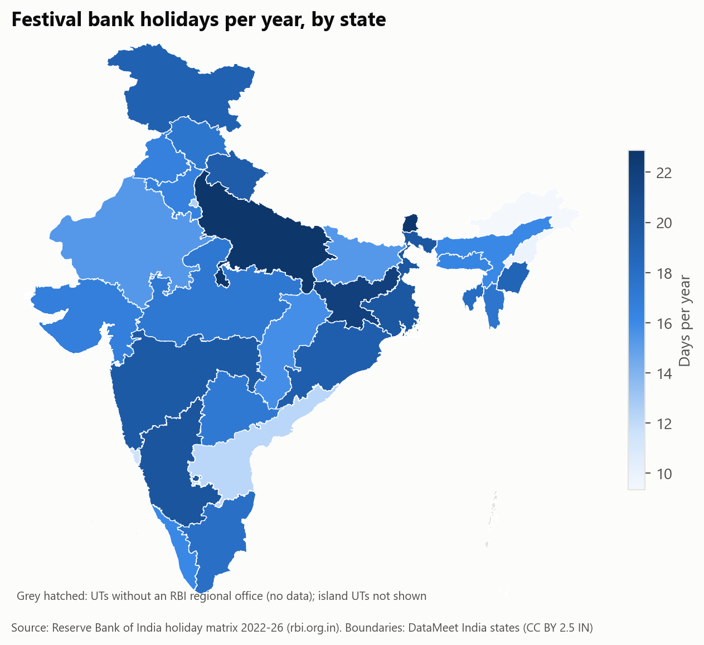
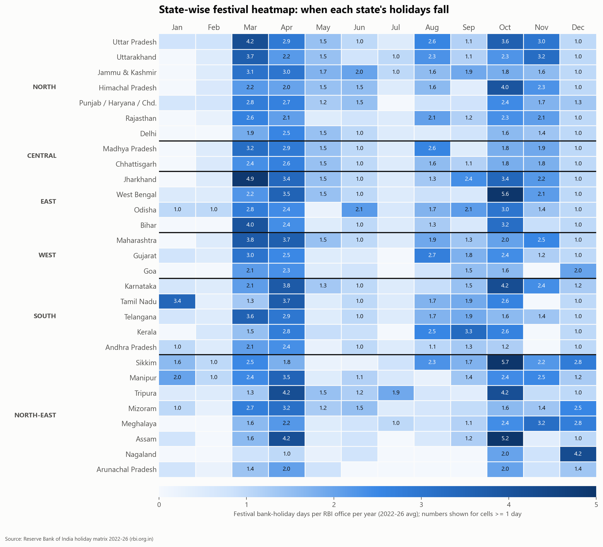
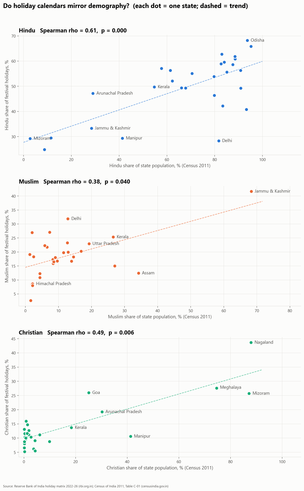
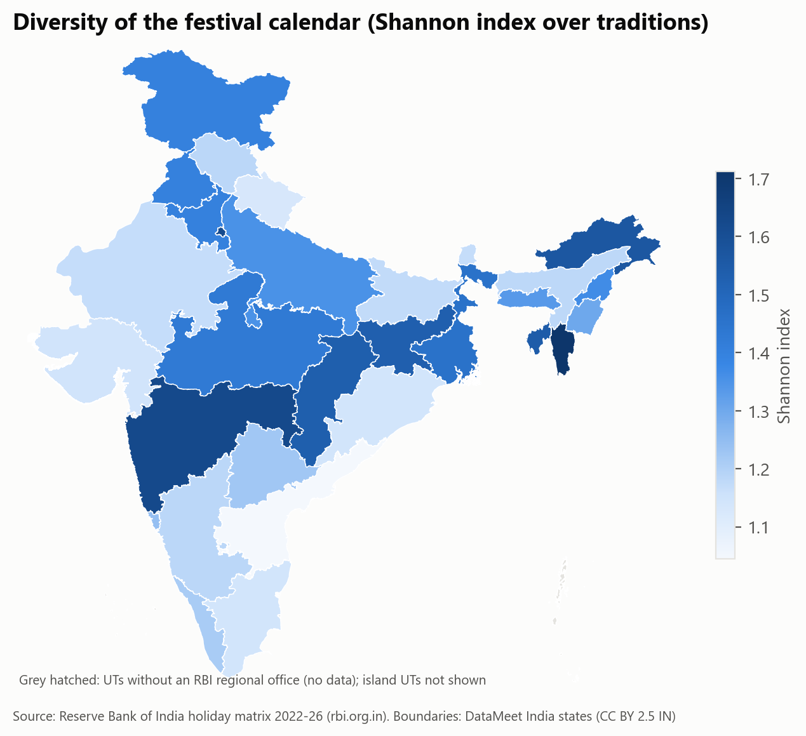
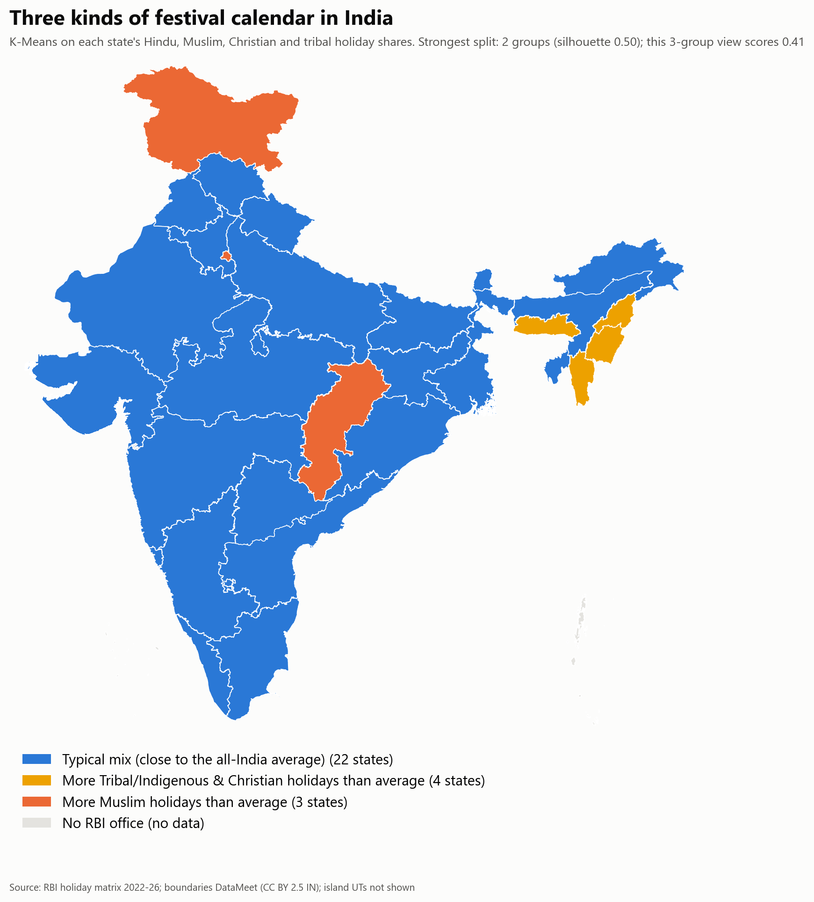
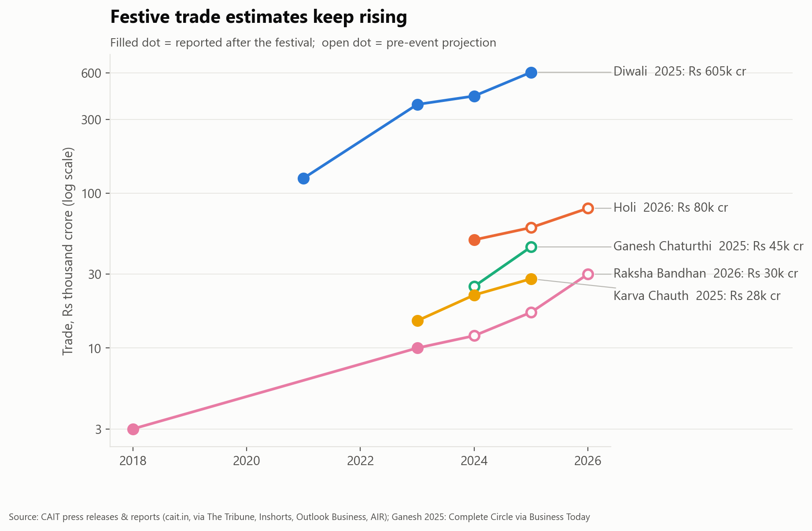
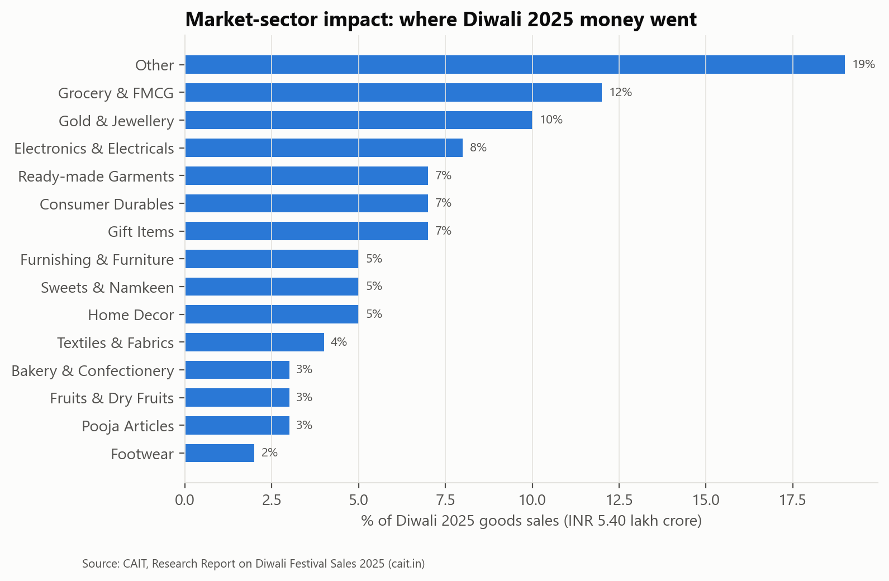
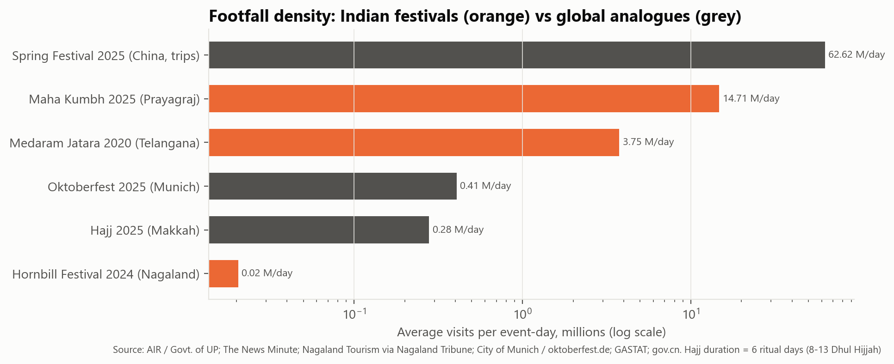

# What India's Bank-Holiday Calendar Reveals About How the Country Celebrates

*A data-driven look at 101 festivals, 29 states, five years of official holidays, and the economics of celebration*

**By Jainam Jain, Vrushan Patil, Dhanush Chowke, Aditya Tambe and Vivek Jaiswal** · B.E. (Electronics & Computer Science), Vidyalankar Institute of Technology · Data Analytics & Visualization project

---

Ask ten people "which festivals matter most in India?" and you'll get ten answers, usually shaped by where they grew up. We wanted to swap opinion for evidence. So we built a dataset where **every record traces to an official or verifiable source**, and asked three questions:

1. **When and where** does India officially pause to celebrate?
2. **Whose** festivals appear on the calendar, and how does that compare with who actually lives in each state?
3. **What is it worth**, economically, and how do we even measure that?

No festival is ranked as "better" here, and no community is singled out. The numbers are what they are, and every figure has a footnote.

## How the data was built

- **Festival dates and state coverage:** the Reserve Bank of India's official holiday matrix for all 34 RBI regional offices (29 states/UTs), covering **every holiday from 2022 to 2026**. That gives 3,271 festival-holiday observations for **101 distinct festivals**.[1]
- **Tradition of each festival:** taken from each festival's Wikipedia infobox ("Observed by"). Where no article exists, we used Government of India / State tourism portals.[2]
- **Demography:** Census of India 2011, Table C-01 (religion by state), the latest published religion census.[3]
- **Economics and footfall:** 78 figures, each opened and checked on its source page. Sources include CAIT trade surveys, state governments, All India Radio, and verified news outlets. Global comparisons come from NRF (US), China's Ministry of Culture & Tourism, Saudi GASTAT and the City of Munich.[4]

**How we kept the count fair.** Three things in the raw data could quietly under-count some festivals, so we corrected for each:

- **Sundays.** RBI lists no Sunday dates, because banks are closed anyway. A festival that falls on a Sunday simply vanishes for that year (Christmas 2022, Ram Navami 2025, Muharram 2025). We average each festival only over the years it could be listed.
- **Shared dates.** RBI prints one combined label per date for the whole country (e.g. *"Ambedkar Jayanti / Vishu / Bihu / Baisakhi"*). We do not split that day blindly. If a state is confirmed to observe a festival, the festival counts in full there, even when it shares the date. Confirmation comes from three sources: the state's office closing on a date where the festival stood alone, the Central Government's list of compulsory holidays,[10] or the festival's home community.[2]
- **What remains uncertain** is split and flagged. That affects 19 of the 101 festivals.

**What this data cannot see:** holidays only for government offices or schools, optional (restricted) holidays, district-level holidays, festivals that carry no bank holiday at all, and the union territories without an RBI office. Bank holidays measure **official recognition**, not how many people celebrate.

## 1. The calendar has two big peaks: March–April and October

*Fig. 1: Festival bank-holiday days per RBI office, by month and tradition, averaged over 2022–26.[1]*

Festival holidays are **not spread evenly** across the year. A chi-square goodness-of-fit test rejects uniformity decisively (χ² = 825, df = 11, p < 0.001).[5]

- **April** (2.8 days per office) and **March** (2.6) are the busiest months. Holi, Eid-ul-Fitr, Good Friday, Mahavir Jayanti and the spring New Year festivals (Ugadi, Gudi Padwa, Bihu, Vishu, Baisakhi, Cheiraoba) all fall here.
- **October** (2.7) belongs almost entirely to the Navratri–Durga Puja–Dussehra–Diwali season.
- **December** is Christmas; **November** is Guru Nanak Jayanti and Chhath; **May–June** carry Buddha Purnima and Eid-ul-Adha.
- **January, February and July** are the quietest months, at about half a day each.

**Is a festival's season linked to its faith?** Not significantly. A chi-square test of tradition × IMD season gives a permutation p of 0.78 (Cramér's V = 0.14). Every tradition has festivals spread across the year.

## 2. The state-wise picture

*Fig. 2: Festival bank holidays per year, by state.[1]*

- **Most festival holidays per year:** Uttar Pradesh (22.9), Sikkim (22.8), Jharkhand (22.0), Karnataka (20.1), West Bengal (20.0).
- **Fewest:** Arunachal Pradesh (9.3), Nagaland (9.8), Goa (11.5), Andhra Pradesh (12.2), Delhi (12.6).
- **National average:** about 17 recognised festival holidays per year.

Across the six regions, a Kruskal–Wallis test found **no significant difference** in holiday counts (p = 0.80). Big differences exist between individual states, not between North, South, East, West, Central and the North-East as blocks.

*Fig. 3: State-wise heatmap of festival bank-holiday days by month. Darker cells mark each state's festival season: Tamil Nadu in January (Pongal), West Bengal, Tripura and Sikkim in October, and Nagaland, Mizoram and Meghalaya in December.[1]*

## 3. Do holiday calendars mirror demography?

This was the question we cared about most.

*Fig. 4: Each dot is a state. The x-axis shows a faith's share of the population (Census 2011); the y-axis shows its share of that state's festival holidays.[1, 3]*

**Yes, for every faith tested.** The share of a state's festival holidays belonging to each tradition rises with that community's population share:

- **Jain:** ρ = 0.66 (p < 0.001)
- **Buddhist:** ρ = 0.65 (p < 0.001)
- **Sikh:** ρ = 0.64 (p < 0.001)
- **Hindu:** ρ = 0.61 (p < 0.001)
- **Christian:** ρ = 0.49 (p = 0.006)
- **Muslim:** ρ = 0.38 (p = 0.040)

(ρ is the Spearman rank correlation across 29 states/UTs; 1 would mean a perfect match. All six stay significant after a Holm correction for testing six faiths at once. The Muslim link is the weakest: its 95% bootstrap interval runs from about 0 to 0.73.)

**But the calendar is flatter than the population.** Nationally, Hindus are 79.8% of the population (Census 2011)[3] but Hindu festivals make up about **49%** of recognised festival holidays. Muslim festivals make up about 20% (population 14.2%), Christian festivals about 12% (population 2.3%), tribal and indigenous festivals about 5%, Sikh 4% (population 1.7%), Buddhist 4% (0.7%) and Jain 3% (0.4%).

The reason is structural. A handful of festivals (Christmas, Good Friday, the two Eids, Buddha Purnima, Mahavir Jayanti, Guru Nanak Jayanti) are **gazetted almost nationwide**, whatever the local population. Hindu festivals are more numerous (45 of 101) but more **regional**: their median reach is under two states. Reach does differ by tradition (Kruskal–Wallis p = 0.016). The shared national calendar gives minority traditions visibility beyond their numbers. The regional calendar reflects local majorities.

*Fig. 5: Diversity of each state's festival calendar (Shannon index across traditions).[1]*

Mizoram, Maharashtra and Delhi have the most diverse holiday calendars. A state's religious diversity in the Census is only weakly related to how diverse its holiday calendar is, and the link is not statistically significant (ρ = 0.31, p = 0.10).

## 4. What machine learning adds

**Clustering states by their calendar.** We ran K-Means on each state's Hindu, Muslim, Christian and tribal/indigenous holiday shares.

- **The strongest split is into two groups** (silhouette = 0.50; bootstrap stability ARI = 0.68). Four north-eastern hill states (Manipur, Meghalaya, Mizoram and Nagaland) have calendars with far more Christian and tribal/indigenous holidays, about a quarter each. The other 25 states form one broad group.
- **A three-group view** (silhouette = 0.41) also separates Delhi, Jammu & Kashmir and Chhattisgarh, where Muslim festivals are about a third of festival holidays.

Outside those groups, the calendar mix is a continuum. It does not follow the usual North / South / East / West blocks (agreement with regions: ARI = 0.01).

*Fig. 6: States grouped by the mix of their festival calendar (K-Means, three-group view). Colours match the tradition colours used throughout.*

**Can a festival's date and footprint reveal its faith?** Only partly. A Random Forest reached macro-F1 = 0.45, against 0.15 for a majority-class baseline (repeated 5-fold cross-validation).

- The strongest signal is **North-East presence**, which separates tribal and indigenous festivals.
- The model often **confuses Diwali, Holi and Dussehra with the Eids and Christmas**, because nationwide festivals of every faith share the same kind of footprint.

In calendar terms, India's biggest festivals look more alike than different.

## 5. The economics of celebration

*Fig. 7: Festive trade estimates by year. Open markers are pre-event projections.[6]*

According to CAIT's national trader surveys:

- **Diwali 2025:** ₹6.05 lakh crore (about US$68.8 billion), made up of ₹5.40 lakh crore in goods and ₹65,000 crore in services. That is up from ₹1.25 lakh crore in 2021.[6]
- **Holi:** ₹60,000 crore in 2025, with ₹80,000 crore projected for 2026.[6]
- **Raksha Bandhan:** ₹17,000 crore projected for 2025, up from ₹3,000 crore in 2018.[6]
- **Karva Chauth 2025:** ₹28,000 crore.[6]

A pooled log-linear model with a separate term for each festival estimates **about 34% annual growth** in reported festive trade (95% CI 27–41%, p < 0.001). A version trained only on data up to 2025 predicted CAIT's 2026 Holi figure within 3% and its Raksha Bandhan figure within 23%.[5]

*Fig. 8: Where Diwali 2025 spending went. Grocery/FMCG (12%), jewellery (10%) and electronics (8%) lead.[6]*

**Crowds.** Maha Kumbh 2025 recorded 66.21 crore visits over 45 days, according to All India Radio / the Government of UP. That is about **1.47 crore visits a day**.[7] Telangana's Medaram Jatara, among India's largest tribal gatherings, drew about 1.5 crore people in four days in 2020.[7]

*Fig. 9: Average visits per event-day, Indian festivals vs global analogues.[7]*

For scale:

- The US holiday season (Nov–Dec 2024) generated **US$994 billion** in retail sales.[8]
- China's 2025 Spring Festival generated **¥677 billion** (about US$94 billion) in tourism spending alone.[8]
- Oktoberfest drew about **6.5 million** visitors in 2025.[8]

## A measurement blind spot worth naming

While building the economic table, we found that **nationwide spending estimates are published regularly for Hindu festivals, but rarely for Eid, Christmas, Gurpurab, Buddha Purnima or tribal festivals.** For those, the verifiable numbers are mostly footfall or pilgrimage counts (Hajj, Hornbill, Medaram).

This is not evidence that other festivals matter less economically. **It shows what gets measured.** Anyone comparing "festival economies" in India should keep that gap in mind. It is also an open invitation to researchers and industry bodies to fill it.

## Key takeaways

1. India's official festival calendar peaks in **March–April and October**. Every tradition is spread across the year.
2. Holiday calendars **track demography** (ρ between 0.38 and 0.66 for every faith). They are also **more plural than the population**, because a set of minority festivals is recognised nationwide.
3. Four north-eastern hill states have a clearly distinct calendar. The rest of India is a continuum that does **not** follow regional blocks.
4. Reported festive trade is growing fast, about 34% a year. But these are survey estimates, often pre-event, and they cover some traditions far better than others.

**What would you add?** If you know a verified data source for festival spending on Eid, Christmas, Gurpurab or tribal festivals, please share it in the comments. We'll update the dataset and credit you.

*All code, the cleaned dataset and a full data dictionary are available on GitHub: https://github.com/iJainamJain/indian-festivals-data-analysis*

---

### Sources and footnotes

1. Reserve Bank of India, *Holidays under the Negotiable Instruments Act*, holiday matrix for all regional offices, 2022–2026. https://www.rbi.org.in/Scripts/HolidayMatrixDisplay.aspx (retrieved 5 Oct 2026). Figures are Sunday-corrected; shared dates are credited by evidence, as described above.
2. Wikipedia infobox "Observed by" field, fetched through the MediaWiki API for each festival. Where no article exists: Ministry of Tourism, utsav.gov.in (Pang Lhabsol, Nongkrem Dance); Govt. of Sikkim, soreng.nic.in/festivals (Drukpa Tshe-zi, Saga Dawa); Govt. of Manipur, dtahills.mn.gov.in/kut (Kut); Govt. of Meghalaya, megtourism.gov.in (Shad Suk Mynsiem). The same "Observed by" field supplies each regional festival's home community.
3. Census of India 2011, Table C-01, *Population by religious community*. https://censusindia.gov.in/nada/index.php/catalog/11361. Telangana and Andhra Pradesh are rebuilt from the 2011 district tables.
4. The full list of 78 records, each with its URL and verification date, is in `economic_footfall_raw.csv` in the repository.
5. Author's analysis. Tests are two-sided at α = 0.05. Full tables are in the Statistical Valuation & EDA report.
6. CAIT: Diwali 2025 — cait.in (10 Nov 2025) and IBEF (22 Oct 2025); Diwali 2021, 2023, 2024 — The Tribune (3 Oct 2025; Nov 2023); Holi — cait.in (8 Apr 2025) and All India Radio (22 Feb 2026); Raksha Bandhan — cait.in (14 Jul 2025), Inshorts (Aug 2024) and Outlook Business (25 Aug 2026); Karva Chauth — The Tribune (10 Oct 2025); Ganesh Chaturthi 2024 — cait.in (10 Sep 2024); Ganesh Chaturthi 2025 — Complete Circle Consultants via Business Today (6 Sep 2025).
7. Maha Kumbh — All India Radio, newsonair.gov.in (26 Feb 2025); Medaram — The News Minute (9 Feb 2020); Hornbill 2024 — Nagaland Tourism via Nagaland Tribune (11 Dec 2024); Hajj 2025 — GASTAT, stats.gov.sa (5 Jun 2025).
8. National Retail Federation (16 Jan 2025); Government of the PRC, english.www.gov.cn (5 Feb 2025); City of Munich, muenchen.de.
9. Project repository (code, data, data dictionary): https://github.com/iJainamJain/indian-festivals-data-analysis
10. Department of Personnel & Training, Government of India, O.M. F.No.12/2/2023-JCA dated 3 July 2025, *Holidays to be observed in Central Government Offices during the year 2026* (list of 14 compulsory holidays).
